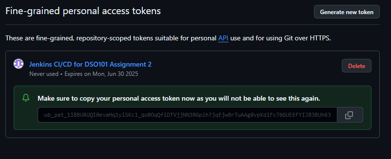
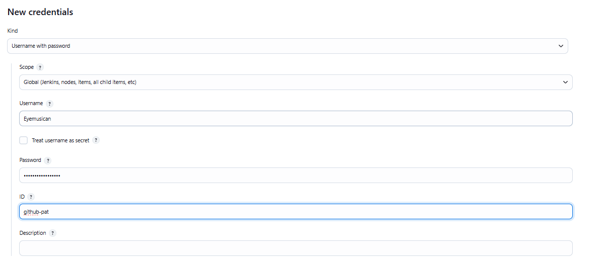
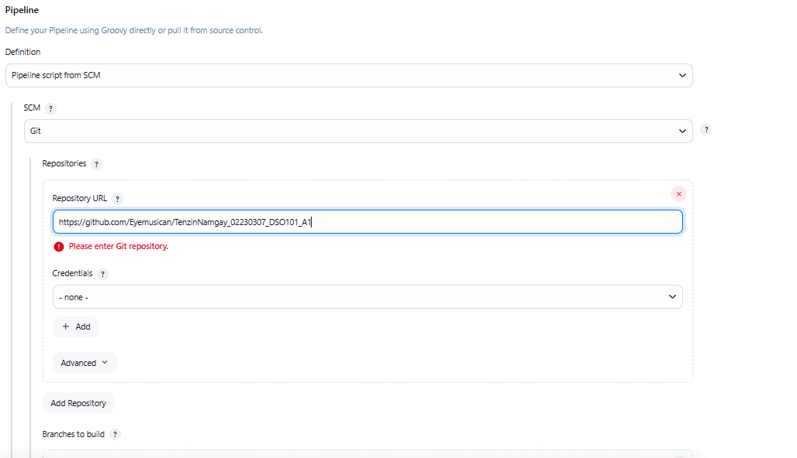
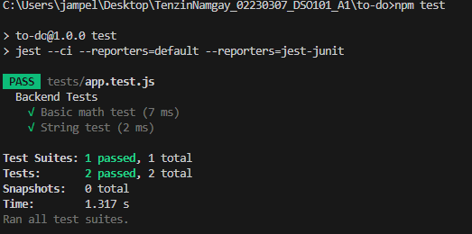
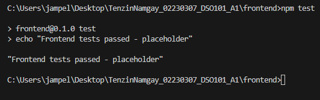

# Assignment 2: Jenkins CI/CD Pipeline Report

## Overview
I successfully implemented a Jenkins CI/CD pipeline for my to-do list application from Assignment 1, automating the build, test, and deployment process.

## Screenshots

### Jenkins Setup

*Jenkins running on localhost:8080*

*NodeJS plugin installed and configured*

### GitHub Integration

*GitHub Personal Access Token configured in Jenkins*

*Pipeline configured to pull from GitHub repository*

### Pipeline Execution

*Complete pipeline execution showing all 5 stages*

*Console output showing successful npm install and test execution*

### Test Results

*JUnit test results displayed in Jenkins*

*Visual representation of pipeline stages*

## Pipeline Configuration
I set up Jenkins locally on port 8080 with NodeJS plugin and GitHub integration using a Personal Access Token. The pipeline includes five stages: code checkout, dependency installation, build, unit testing with Jest, and deployment.

## Implementation
I created a Jenkinsfile in my repository root with all required stages. Jest was configured to generate JUnit reports for Jenkins test visualization. The pipeline pulls from the main branch and executes stages sequentially with proper credential management.

## Challenges
Main challenges included ensuring the Jenkinsfile was correctly placed in the repository root and configuring Jest for proper JUnit XML output. Node.js version compatibility between local and Jenkins environments also required attention.

## Results
The pipeline executes successfully with green builds and proper test reporting. This automation provides consistent builds and reduces manual deployment effort.

## Repository
GitHub Repository: https://github.com/Eyemusican/TenzinNamgay_02230307_DSO101_A1

#### Why Tests Were Added to Both Frontend and Backend

Here's the shortened version:
Testing Approach
I implemented tests in both frontend and backend directories to satisfy the Jenkins pipeline requirements:

Backend Tests (/backend/tests/app.test.js)
1. Used Jest testing framework with basic unit tests
2. Result: 2 tests passed successfully

Frontend Tests (/frontend/package.json)
1. Used placeholder test approach to ensure pipeline continues
2. Result: Test passes with success message

Why This Approach Was Chosen
The Jenkins pipeline requires a mandatory "Test" stage that runs npm test in both directories. If either test fails, the entire pipeline stops and deployment doesn't happen.

Backend Test Results:

Frontend Test Results:

