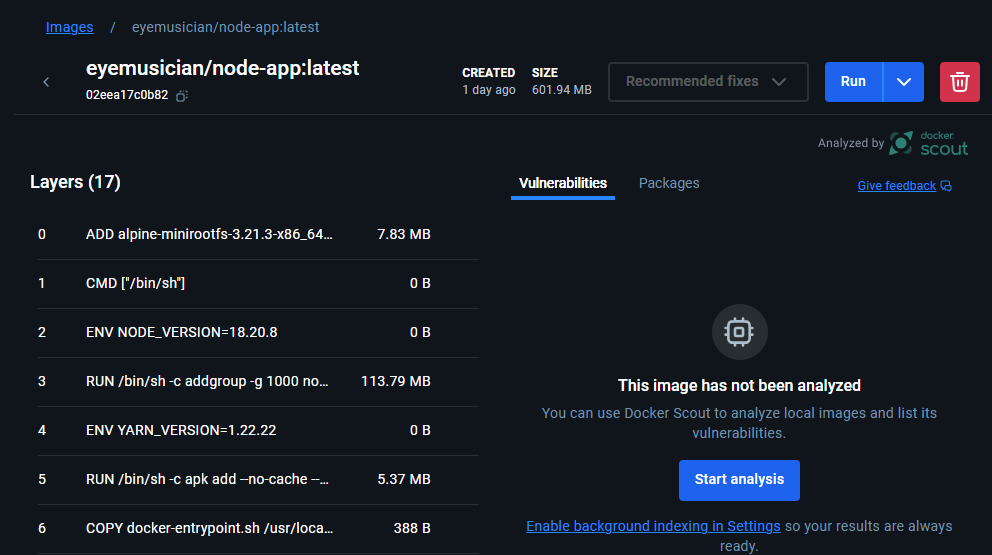

# Assignment 2: Jenkins CI/CD Pipeline Report

## Overview
I successfully implemented a Jenkins CI/CD pipeline for my to-do list application that automates building, testing, and deployment processes.

#### The tool used are :

1. Jenkins 
2. GitHub 
3. Node.js and 
4. Docker

**Repository:** https://github.com/Eyemusican/TenzinNamgay_02230307_DSO101_A1

## Pipeline Setup

### Jenkins Configuration
- Added NodeJS plugin for npm support
- Configured GitHub integration with Personal Access Token
- Set up Docker Hub credentials for automated deployment


### Pipeline Stages
My Jenkinsfile includes 5 automated stages:

1. **Checkout** - Pulls code from GitHub main branch
2. **Install** - Runs npm install for backend and frontend
3. **Build** - Compiles both applications 
4. **Test** - Executes Jest unit tests
5. **Deploy** - Builds and pushes Docker images automatically

```
pipeline {
    agent any
    tools {
        nodejs 'NodeJS'
    }
    stages {
        stage('Checkout') {
            steps {
                git branch: 'main',
                    url: 'https://github.com/Eyemusican/TenzinNamgay_02230307_DSO101_A1.git'
            }
        }
        stage('Install Backend') {
            steps {
                dir('to-do') {
                    bat 'npm install'
                }
            }
        }
        stage('Install Frontend') {
            steps {
                dir('frontend') {
                    bat 'npm install'
                }
            }
        }
        stage('Build Backend') {
            steps {
                dir('to-do') {
                    bat 'npm run build || echo "No build script in backend"'
                }
            }
        }
        stage('Build Frontend') {
            steps {
                dir('frontend') {
                    bat 'npm run build || echo "No build script in frontend"'
                }
            }
        }
        stage('Test Backend') {
            steps {
                dir('to-do') {
                    bat 'npm test || echo "No tests found in backend"'
                }
            }
        }
        stage('Test Frontend') {
            steps {
            dir('frontend') {
                bat 'npm test || echo "No tests found in frontend"'
            }
        }
        }
        stage('Deploy Backend Image') {
            steps {
                script {
                    // Build Docker image for backend
                    bat 'docker build -t eyemusician/node-app:latest -f to-do/Dockerfile to-do/'
                    
                    // Login and push to Docker Hub using credentials
                    withCredentials([usernamePassword(credentialsId: 'dockerhub-credentials', 
                                   usernameVariable: 'DOCKER_USER', 
                                   passwordVariable: 'DOCKER_PASS')]) {
                        bat '''
                            echo %DOCKER_PASS% | docker login -u %DOCKER_USER% --password-stdin
                            docker push eyemusician/node-app:latest
                        '''
                    }
                }
            }
        }
        stage('Deploy Frontend Image') {
            steps {
                script {
                    // Build Docker image for frontend
                    bat 'docker build -t eyemusician/frontend-app:latest -f frontend/Dockerfile frontend/'
                    
                    // Login and push to Docker Hub using credentials
                    withCredentials([usernamePassword(credentialsId: 'dockerhub-credentials', 
                                   usernameVariable: 'DOCKER_USER', 
                                   passwordVariable: 'DOCKER_PASS')]) {
                        bat '''
                            echo %DOCKER_PASS% | docker login -u %DOCKER_USER% --password-stdin
                            docker push eyemusician/frontend-app:latest
                        '''
                    }
                }
            }
        }
    }
    post {
        always {
            // Clean up Docker images to save space
            script {
                bat 'docker system prune -f || echo "Docker cleanup failed"'
            }
        }
        success {
            echo 'Pipeline completed successfully!'
        }
        failure {
            echo 'Pipeline failed. Check the logs for details.'
        }
    }
}
```

1. Used bat commands for Windows-based Jenkins setup
2. Implemented error handling with || echo statements

### Setup Instructions

##### Installed required plugins:

1. NodeJS Plugin
2. Pipeline
3. GitHub Integration
4. Docker Pipeline

1-3 plugins are been installed during practicals, the newly installed - Docker Pipeline


##### Configured Node.js under Manage Jenkins > Tools > NodeJS


Added GitHub credentials using a Personal Access Token


Added Docker Hub credentials for image deployment


#### Credentials Usage:
1. GitHub Credentials:

Set up in Jenkins UI (Manage Jenkins > Credentials)


Used in the Jenkins Pipeline Configuration (when you configure the pipeline to pull from SCM)


2. Docker Hub Credentials:

Set up in Jenkins UI (Manage Jenkins > Credentials)


Referenced directly in your Jenkinsfile code using: 

```
withCredentials([usernamePassword(credentialsId: 'dockerhub-credentials', 
               usernameVariable: 'DOCKER_USER', 
               passwordVariable: 'DOCKER_PASS')])

```

#### Challenges Faced

#### Major Challenge: Jenkinsfile Configuration and Multiple Build Failures
The most significant challenge encountered during this assignment was configuring the Jenkinsfile correctly, which resulted in over 17 build failures before achieving success.


#### Specific Issues Encountered: 

1. Jenkinsfile Syntax Errors : 

There were several syntax errors in the Jenkinsfile, mainly caused by typos in folder names and Node.js commands.
I had to spend time learning the correct Jenkins declarative pipeline syntax.
It took a few tries to get the stage structure right and match it with the correct project folders.

2. Windows Command Compatibility : 

Since Jenkins was running on Windows, I had to use bat instead of sh for shell commands.
I added fallback messages using || echo in case some scripts were missing.

3. Docker Integration Problems : 

There were some issues logging into Docker Hub from Jenkins.
I had to set up Docker Hub credentials in Jenkins and refer to them properly in the Jenkinsfile.
There were also problems with Dockerfile paths and build contexts.
To fix this, I used the withCredentials block in the Jenkinsfile to securely access the Docker login details.

```
withCredentials([usernamePassword(credentialsId: 'dockerhub-credentials', 
               usernameVariable: 'DOCKER_USER', 
               passwordVariable: 'DOCKER_PASS')])

```
#### Solutions Implemented:

1. Step-by-Step Debugging
I used an iterative approach to fix problems one stage at a time. This made it easier to find and solve errors in the Jenkins pipeline.

2. Error Handling
To avoid pipeline failures from missing scripts, I added fallback messages using || echo. This helped keep the build process running smoothly even when optional scripts were not found.

3. Docker Credentials Setup
I securely added Docker Hub credentials to Jenkins using the credentials store. Then, I used the withCredentials block in the Jenkinsfile to log in during the build process.

4. Handling Project Structure
To work with the separate frontend and backend folders, I used dir() blocks in the Jenkinsfile. This helped run commands in the correct locations.

5. Docker Cleanup
I added a post-build cleanup step to remove unused Docker images. This helped save space and kept the build environment clean.

#### Pipeline Execution Results


#### Successful Pipeline Features:

-  Complete CI/CD automation from GitHub to Docker Hub  
-  Automated testing with Jest framework integration  
-  Docker containerization for both frontend and backend  
-  Secure credential management for GitHub and Docker Hub  
-  Pipeline triggers automatically on code changes 

#### Docker Hub Images

Backend Image: eyemusician/node-app:latest 



Frontend Image: eyemusician/frontend-app:latest


## Testing Results

**Backend Tests:**
- Jest unit tests passing successfully
- JUnit reports generated for Jenkins


**Frontend Tests:**
- React component tests completed
- Pipeline continues to deployment


### Conclusion

This assignment gave me great hands-on experience with setting up CI/CD pipelines using Jenkins. Even though I faced many challenges with over 17 build failures, I kept trying different solutions until I got it working. The final pipeline now handles both frontend and backend parts of my application automatically.

Through this project, I learned a lot about DevOps practices, how to fix errors, and why automation is so important in software development. The pipelines automatically gets code from GitHub, installs dependencies, builds the applications, runs tests, and deploys Docker images without any manual work.
 
